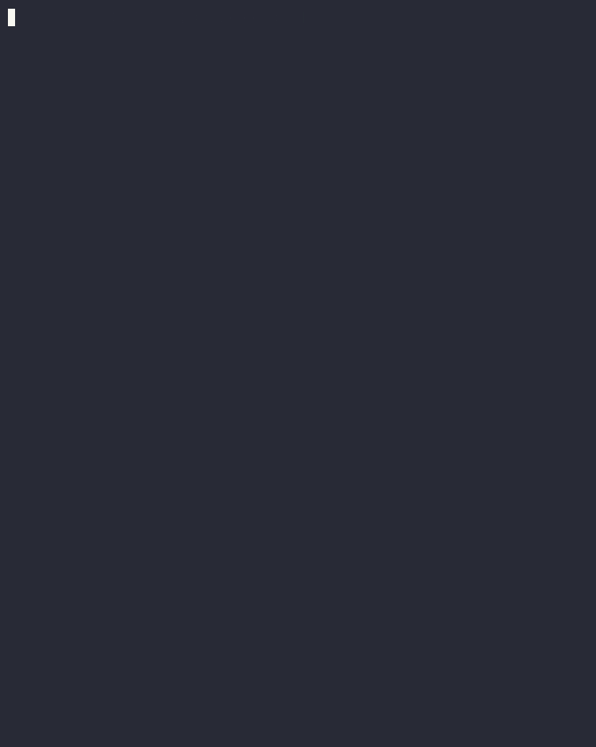

# stash


**Log terminal commands and their outputs into clean markdown writeups.**

[](https://golang.org/)
[](LICENSE)
[]()

---

> Built for CTF writeups, pentest reports, or keeping a structured record of what you ran and what came back. Start a session, log your commands, end when done.

---

## Demo



## Output format 

[View sample output](demo.md)

---

## Installation - Current

```bash
git clone https://github.com/aadhur/stash
cd stash
go build -o stash
mv stash /usr/local/bin/ 
```

> Alternatively, if your `GOPATH/bin` is in PATH, you can just run `go install` instead of the `mv` step.

---

## Usage

### Start a session

```bash
stash start <filename>
```

Creates `filename.md` and begins the session. Only one session can be active at a time.

```bash
# Resume a previously ended session
stash start -r <filename>
```

### Log a command

Runs the command, streams output live to your terminal, and records both into the `.md` file.

```bash
stash log -- <command>

# With a command title
stash log -c "Recon" -- nmap -sV 10.10.10.1
```

### Add a comment

```bash
stash comment <text>

# With a section divider and title
stash comment -t "Initial Foothold" "Got shell via CVE-2024-XXXX"
```

### Other commands

```bash
stash status   # show active session
stash end      # close the session
```

---


## Reference

| Command | Description |
|---|---|
| `start <name>` | Start a new session |
| `log <command>` | Run and record a command |
| `comment <text>` | Add a note |
| `status` | Show active session |
| `end`  | End the session |

| Flag | Command | Description |
|---|---|---|
| `-r` | `start` | Resume an existing `.md` file |
| `-c` | `log` | Add a command title before the log |
| `-t` | `comment` | Add a secondary title before the entry |

---

## Dependencies

- [spf13/cobra](https://github.com/spf13/cobra) — CLI framework
- [fatih/color](https://github.com/fatih/color) — terminal colors

---

## License

MIT

---

built by <a href="https://github.com/aadhur">aadhur</a> · made for the terminal
